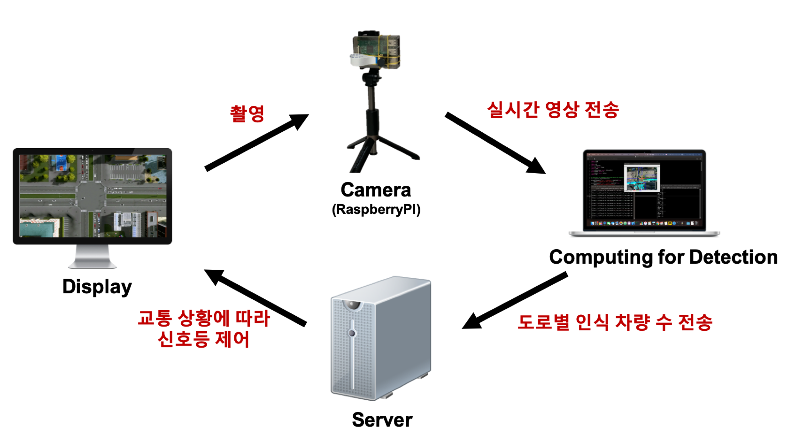
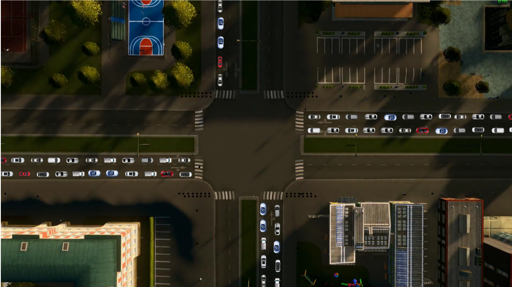
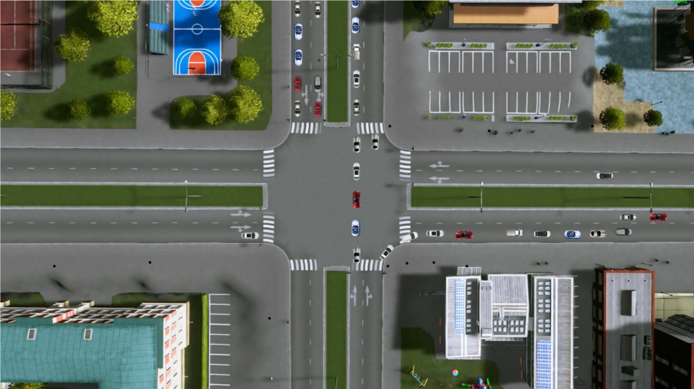
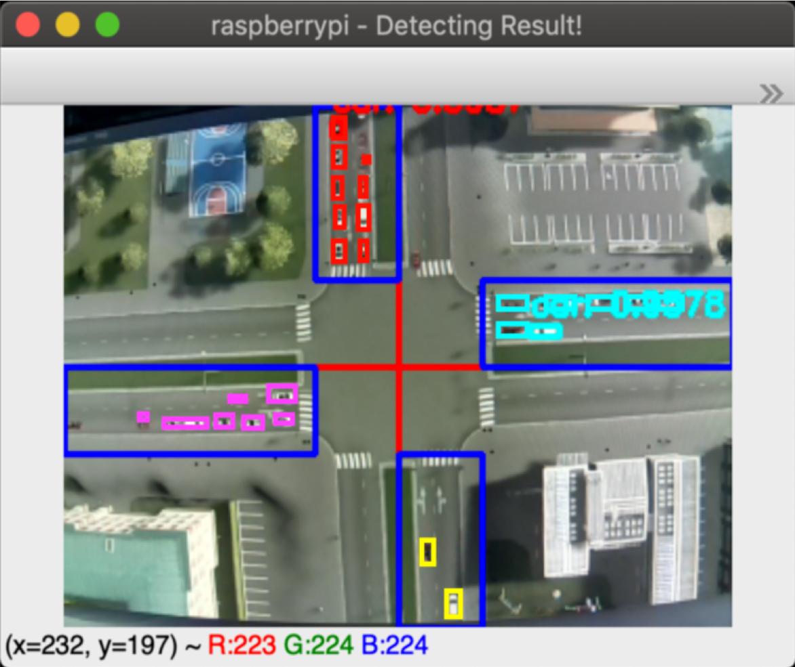
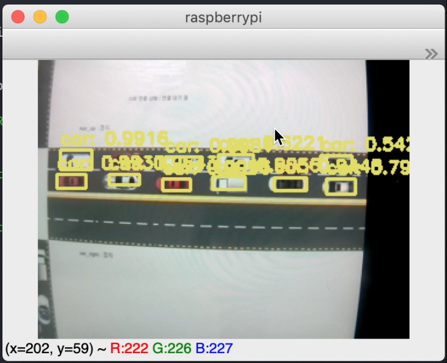
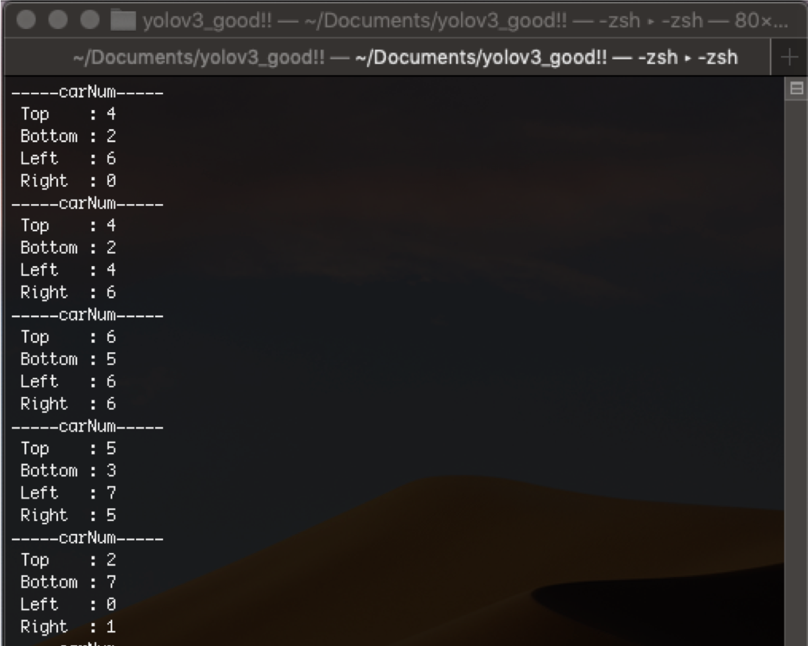
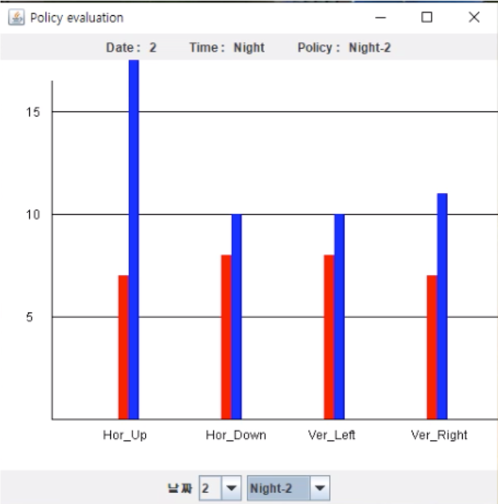
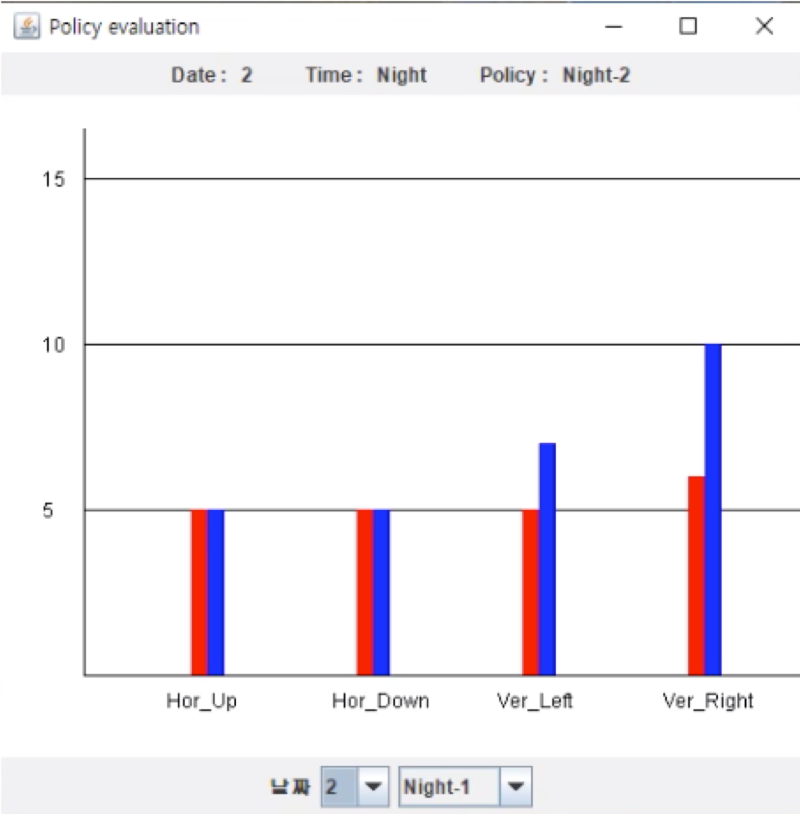

# Capstone Design Project 2019
## [KwangWoon University - Computer Software](http://cs.kw.ac.kr/)

 [Contributor]
- *Prof. DongHo Lee*
- *HoChan Byun*
- *JunYoung Jung*
- *KangMin Kim*

# *Intelligent Traffic Signal Using a Small Computer*
## Usage
1. Run Unity Program to simulate traffic situation
2. Run Server
3. Run Detective Program using Python
4. Run RaspberryPI Camera

## Information

### Intro Video

↑↑↑Click↑↑↑

### 1. 기획 배경 및 개발 동기
사거리는 출퇴근 시간, 한적한 낮, 새벽시간 등 차량 수에 상관 없이 시간대에 따라 고정된 신호 주기로 교통흐름이 통제된다. 그로 인해 불필요한 대기시간이 발생하여 효율적인 차량 흐름에 방해가 된다. 이미 비슷한 선행 기술로 도로에 차량검지기를 매설하여 측정하는 ITS *(Intelligent Transport System)* 이나, 6년간 축적한 사거리 데이터를 토대로 차량을 통제하는 암스테르담의 ITS가 있다. 그러나 선행기술들은 대부분 고비용이 요구되는 기술이다. 우리는 저렴한 비용으로 초소형컴퓨터 `Raspberry Pi`를 이용하여 차량의 대기시간을 감소시켜, 원활한 사거리 교통환경을 만들고자 기획을 하게 되었다.

### 2. 전체 시스템 구성
#### [시스템 구성도] 
현 교통상황을 라즈베리파이로 촬영 후, 빠른 계산을 위해 사양 좋은 컴퓨터로 실시간으로 영상을 전송한다. 해당 컴퓨터에서 각 도로당 차량을 `YOLOv3`로 인식하여 차량 수를 서버로 보낸다. 서버에서 각 도로의 차량 수를 토대로 효율적인 교통흐름을 위해 신호등을 제어한다. 

#### [디스플레이] 
출퇴근, 한적한 낮, 새벽 시간별로 차량의 수와 주변환경 을 조절하였으며, 경기도 교통DB센터에서 2017년 교통분석을 바탕으로 차량속도를 상황에 따라 차등적으로 적용했다. 또한, 횡단보도를 건너는 보행자도 차량과 마찬가지로 상황에 따라 다르게 적용했다. 
 

#### [카메라] 
디스플레이를 `Raspberry Pi` 한 대로 촬영하고, `imagezmq` 라이브러리 를 이용하여 촬영한 영상을 실시간으로 인식용 컴퓨터로 보내 각 영역(도로)별 로 차량을 `YOLOv3`로 인식한다. 인식한 차량의 수는 소켓통신을 통해 `JSON` 파일로 서버에게 전달한다.
 

#### [서버] 
`Raspberry Pi`(카메라)로부터 얻은 교통 정보(차량 수, 대기시간 등)를 실시간으로 취득, 종합하여 차량들의 대기시간을 최소화할 수 있는 교통정책을 지시하고, 날짜, 시간대 등 정보를 인식하고 그에 맞는 최적의 정책을 분배한다.

### 3. 적용 기술 및 라이브러리
- 디스플레이는 `C#`환경에서 `Unity`를 이용하여 구현하였다.
- 카메라는 `Python`환경에서 [`imagezmq`](https://github.com/jeffbass/imagezmq)을 이용하여 인식용 컴퓨터로 실시간 영상을 전송하고, 인식용 컴퓨터에서 `OpenCV`, [`Darknet`](https://pjreddie.com/darknet/yolo/)을 이용하여 차량 인식을 구현했다.
- 서버는 `JAVA`환경에서 사거리 신호 정책을 세웠으며, 디스플레이와 인식용 컴퓨터와 `JSON`으로 통신한다. 

YOLOv3모델에 1,030개의 차량이 Bounding Box로 [Labeling](https://github.com/tzutalin/labelImg)된 Image Data를 이용하여 [`Custom Weights file`](https://drive.google.com/drive/folders/1p-jVpYC6uQBFaD1Gr5y6Z7JUIxv96Ufh?usp=sharing)을 Training하였다.
810개의 데이터셋은 `Raspberry Pi` 카메라로 찍어 Downgrade된  이미지로 구성되어 있고 220개의 데이터는 디스플레이에 출력되는 영상 원본을 토대로 이미지 데이터셋을 구성했다.
각 도로의 영역에서 인식된 차량의 수를 서버로 보낸다.

### 4. 분석 및 기대효과
 
- [예시 상황 - 한적한 새벽] 파란 막대는 각 도로별 보행자의 평균 대기시간, 빨간 막대는 차량의 평균 대기시간이다.
위의 그림은 지능화된 정책을 적용했을 때의 대기시간 그래프와 기존 정책을 적용했을 때의 대기시간 그래프이다. Night2보다 Night1의 평균 대기시간이 확연히 줄어들었음을 볼 수 있다.
카메라를 통해 차량을 인식하여 적용한 정책을 실제 도로에 적용하면 더욱 원활한 교통흐름을 결과로 낳을 수 있을 것으로 기대된다.
